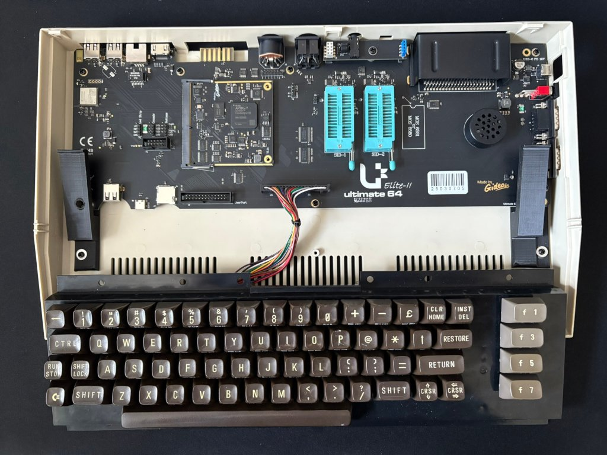

# Ultimate 64 Elite II mounting brackets for the original C64c case.

Can be printed without support when laying on the side. I used PLA which appears to work just fine.

It is a snug fit, so to install, first put in the left bracket, then the board, then slide in the right bracket.

I used double sided tape to fix the brackets in addition to the screw. However, this might be not necessary at all.

# Pictures

